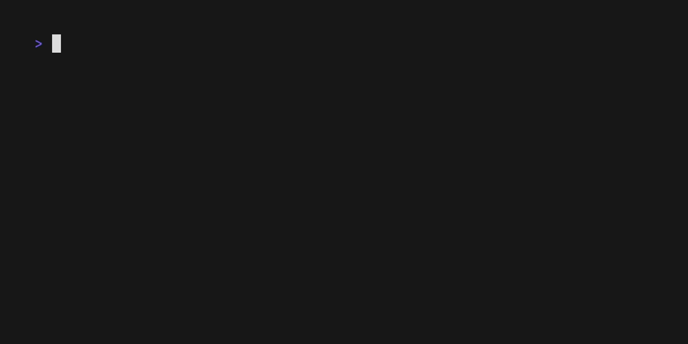

# Regex TUI

A terminal user interface (TUI) application for testing and visualizing regular expressions in real-time.

## Features

- Interactive regex editor with live validation
- RE2 engine by default; [regexp2](https://github.com/dlclark/regexp2) option with partial PCRE compatibility
- Multi-line text input for testing
- Visual highlighting of regex matches with alternating colors
- Real-time feedback as you type the expression
- Clean and intuitive terminal interface
- Tab navigation between regex and text inputs
- Options dialog for toggling global and case-insensitive flags

## Demo



## Installation

### Using go install

The simplest way to install regex-tui is using `go install`:

```bash
go install github.com/vitor-mariano/regex-tui@latest
```

This will install the binary to your `$HOME/go` directory. Make sure this directory is in your `PATH`.

### Arch Linux

regex-rui is available on Arch Linux through AUR. You can use [yay](https://github.com/Jguer/yay) or any other AUR helper you prefer:

```bash
yay -S regex-tui
```

### Manual Installation with Make

Clone the repository and use Make to build and install:

```bash
git clone https://github.com/vitor-mariano/regex-tui.git
cd regex-tui
make install
```

This will compile the application and install it to `$GOPATH/bin/regex-tui`.

## Requirements

- Go 1.25 or later

## Usage

Simply run the command:

```bash
regex-tui
```

The application will launch in full-screen mode with:

- A regex pattern input field at the top (starts with example pattern `[A-Z]\w+`)
- A text input area below (starts with example text "Hello World!")
- Matches highlighted in alternating yellow and blue colors

### Command-Line Options

regex-tui supports several command-line flags to customize the initial state:

#### Available Flags

| Flag            | Shorthand | Description                                       |
| --------------- | --------- | ------------------------------------------------- |
| `--regex`       | `-r`      | Initial regex pattern                             |
| `--text`        | `-t`      | Initial text subject                              |
| `--empty`       | `-e`      | Start with empty expression and text              |
| `--no-global`   |           | Disable global flag (match only first occurrence) |
| `--insensitive` |           | Enable case-insensitive flag                      |
| `--regexp2`     |           | Use regexp2 engine (partial PCRE compatibility)   |

**Notes:**

- When reading from stdin, the `--text` / `-t` flag cannot be used and will result in an error.

#### Examples

```bash
# Custom regex with empty text
regex-tui -e -r "[A-Z]\w+"

# Custom regex and text
regex-tui -r "\d{3}-\d{4}" -t "Call me at 555-1234"

# Case-insensitive matching (global is enabled by default)
regex-tui -r "error" -t "Error: invalid input" --insensitive

# Match only first occurrence
regex-tui -r "foo" -t "foo bar foo" --no-global

# Use regexp2 engine with lookahead
regex-tui -r "foo(?=bar)" -t "foobar foobaz" --regexp2

# Piped text with custom regex
cat log.txt | regex-tui -r "ERROR.*"

# All flags combined
cat file.txt | regex-tui -r "\w+" --no-global --insensitive --regexp2
```

### Keyboard Shortcuts

- **Tab**: Switch between regex input and text input
- **Ctrl+P**: Open the options dialog to toggle regex flags
- **Ctrl+O**: Open text content in an external editor (uses `$EDITOR` environment variable)
- **Esc** or **Ctrl+C**: Exit the application

## Roadmap

- Support highlighting while editing text
- Visualize whitespaces
- Support scroll with long texts

## Development

Other available make targets:

```bash
make run        # Run without installing
make build      # Build the binary locally in bin/regex-tui
make debug      # Build with debug flags and run locally
make clean      # Remove built binary
make uninstall  # Remove installed binary from $GOPATH/bin
make lint       # Run go vet and go fmt
make demo       # Generate demo GIF using vhs
```

## License

This project is open source and available under the MIT License.
